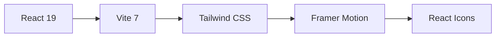

# 🚀 Fauzi Noorsyabani | Personal Portfolio

<div align="center">


**A modern, animated portfolio website showcasing my journey as a Software Engineer & Data Scientist**

[🔗 Live Demo](https://fauzinoorsyabani.vercel.app) • [📧 Contact Me](mailto:career.fauzinoorsyabani@gmail.com) • [💼 LinkedIn](https://www.linkedin.com/in/fauzinoorsyabani/)

</div>

---

## ✨ Features

- **⚡ Blazing Fast** — Built with Vite 7 for instant HMR and optimized production builds
- **🎨 Modern UI/UX** — Mesh gradient backgrounds, smooth animations with Framer Motion
- **📱 Fully Responsive** — Optimized for all screen sizes from mobile to 4K displays
- **🌙 Dark Theme** — Eye-friendly dark mode design throughout
- **⌨️ Typing Animation** — Dynamic role showcase with typewriter effect
- **🔗 Interactive Sections** — Projects with live demos, certifications, achievements & more

## 📋 Sections

| Section            | Description                                                      |
| ------------------ | ---------------------------------------------------------------- |
| **Hero**           | Animated introduction with typing effect & "Open to Work" status |
| **About**          | Education background with key coursework highlights              |
| **Tech Stack**     | Skills organized by Frontend, Backend, Data Science & Tools      |
| **Projects**       | Featured works with live demos and GitHub links                  |
| **Experience**     | Professional work history and leadership roles                   |
| **Awards**         | National competition achievements (Gold Medals!)                 |
| **Certifications** | Professional certifications from BNSP, AWS, Microsoft            |
| **Contact**        | Direct email and social media links                              |

## 🛠️ Tech Stack



| Technology    | Version  | Purpose      |
| ------------- | -------- | ------------ |
| React         | 19.2.0   | UI Library   |
| Vite          | 7.2.4    | Build Tool   |
| Tailwind CSS  | 3.4.19   | Styling      |
| Framer Motion | 12.23.26 | Animations   |
| React Icons   | 5.5.0    | Icon Library |

## 🚀 Quick Start

### Prerequisites

- Node.js 18+
- npm or yarn

### Installation

```bash
# Clone the repository
git clone https://github.com/fauzinoorsyabani/fauzinoorsyabani-porto.git

# Navigate to project directory
cd fauzinoorsyabani-porto

# Install dependencies
npm install

# Start development server
npm run dev
```

The app will be running at `http://localhost:5173`

### Build for Production

```bash
# Create optimized build
npm run build

# Preview production build locally
npm run preview
```

## 📁 Project Structure

```
src/
├── components/          # React components
│   ├── Hero.jsx         # Landing section with typing animation
│   ├── About.jsx        # Education & background
│   ├── TechStack.jsx    # Skills & technologies
│   ├── Projects.jsx     # Portfolio projects
│   ├── Experience.jsx   # Work history
│   ├── Awards.jsx       # Achievements & medals
│   ├── Certifications.jsx # Professional certs
│   ├── Contact.jsx      # Contact form
│   ├── Navbar.jsx       # Navigation
│   ├── Footer.jsx       # Site footer
│   └── MeshBackground.jsx # Animated background
├── data/
│   └── content.js       # All portfolio content (easy to update!)
├── styles/
│   └── index.css        # Custom styles
└── App.jsx              # Main app component
```

## 🎯 Key Highlights

### 🏆 Achievements

- **1st Place** — Badan Ekraf Developer Day (Dicoding & Kemenparekraf) 2025
- **Gold Medalist** — Mathematics KSPI National Competition 2024
- **Gold Medalist** — Accounting ISSC 2024
- **Google Student Ambassador** — Campus Lead for AI/Gemini

### 📜 Certifications

- ICT Project Manager — BNSP Indonesia (2024-2027)
- Cloud Practitioner Essentials — AWS & Dicoding
- Microsoft Office Specialist: Excel Associate

## 🔧 Customization

All content is centralized in `src/data/content.js` for easy updates:

```javascript
// Update your personal info
export const personalInfo = {
  name: "Your Name",
  roles: ["Role 1", "Role 2"],
  email: "your@email.com",
  // ... more fields
};
```

## 📄 License

This project is open source and available under the [MIT License](LICENSE).

## 🤝 Connect With Me

<div align="center">

[](https://www.linkedin.com/in/fauzinoorsyabani/)
[](https://github.com/fauzinoorsyabani)
[](https://www.instagram.com/fauzy.nss/)

**Open to opportunities! Let's build something amazing together. 🚀**

</div>

---

<div align="center">

⭐ Star this repo if you found it helpful!

Made with ❤️ by [Fauzi Noorsyabani](https://github.com/fauzinoorsyabani)

</div>
